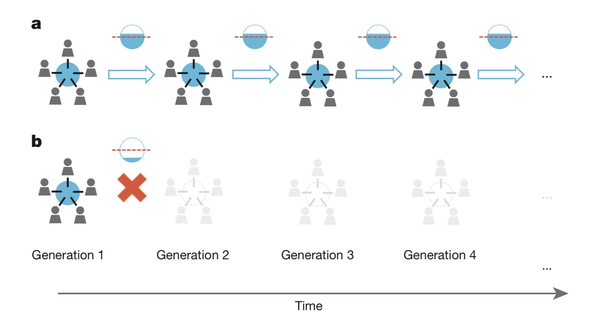
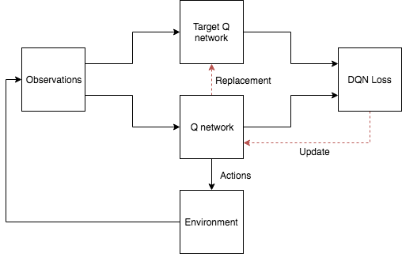
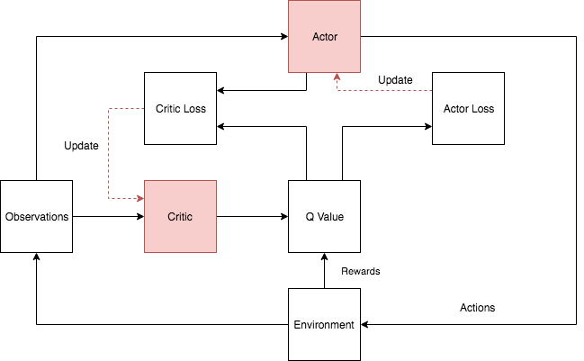

# Deep Multi-Agent Reinforcement Learning in a Common-Pool Resource System

This project includes the source code of the paper: [Deep Multi-agent Reinforcement Learning in a Common-Pool Resource System](https://ieeexplore.ieee.org/abstract/document/8790001/), which is accepted and published on *IEEE CEC 2019*.

## Introduction

In complex social-ecological systems, multiple agents with diverse objectives take actions that affect the long-term dynamics of the system. Common pool resources are a subset of such systems, where property rights are typically poorly defined and dynamics are unknown a priori, creating a social dilemma reflected by the well-known **tragedy of the commons**. In this paper, we investigated the efficacy of deep reinforcement learning in a multi-agent setting of a common pool resource system. We used an abstract mathematical model of the system, represented as a partially-observable general-sum Markov game. In the first set of experiments, the independent agents used a deep Q-Network with discrete action spaces to guide decision-making. However, significant shortcomings were evident. Consequently, in a second set of experiments, a Deep Deterministic Policy Gradient learning model with continuous state and action spaces guided agent learning. Simulation results show that agents performed significantly better in terms of both sustainability and economic goals when using the second deep learning model. Despite the fact that agents do not have perfect foresight nor understanding of the implications of their "harvesting" efforts, deep reinforcement learning can be used effectively to "learn in the commons".

A demonstration of CPR system [[Hauser, Oliver P., et al.]](https://www.nature.com/articles/nature13530):



## Prerequisite

Make sure you have installed `Python` on your machine

## Run the demo
```
./run_demo
```

## Models
You can choose between the following models:

- `DQN`:  [Deep Q-network](http://www.davidqiu.com:8888/research/nature14236.pdf)

- `DDPG`: [Deep Deterministic Policy Gradient](https://arxiv.org/abs/1509.02971)

## Interaction  framework


## DQN Architecture



## DDPG Architecture


## Reference

1. [von der Osten F B, Kirley M, Miller T. Sustainability is possible despite greed-Exploring the nexus between profitability and sustainability in common pool resource systems[J]. Scientific reports, 2017, 7(1): 2307.](https://www.nature.com/articles/s41598-017-02151-y)
2. [Hausknecht, M., & Stone, P. (2015). Deep recurrent q-learning for partially observable mdps. CoRR, abs/1507.06527.](http://www.aaai.org/ocs/index.php/FSS/FSS15/paper/download/11673/11503)
3. [Hauser, O. P., Rand, D. G., Peysakhovich, A., & Nowak, M. A. (2014). Cooperating with the future. *Nature*, *511*(7508), 220.](https://www.researchgate.net/profile/David_Rand2/publication/263815931_Cooperating_with_the_future/links/553f5e900cf24c6a05d208d1.pdf)
4. [Mnih V, Kavukcuoglu K, Silver D, et al. Human-level control through deep reinforcement learning[J]. Nature, 2015, 518(7540): 529.](http://www.davidqiu.com:8888/research/nature14236.pdf)
5. [Kulkarni T D, Narasimhan K, Saeedi A, et al. Hierarchical deep reinforcement learning: Integrating temporal abstraction and intrinsic motivation[C]//Advances in neural information processing systems. 2016: 3675-3683.](http://papers.nips.cc/paper/6233-hierarchical-deep-reinforcement-learning-integrating-temporal-abstraction-and-intrinsic-motivation.pdf)
6. https://github.com/Ceruleanacg/Reinforcement-Learning
